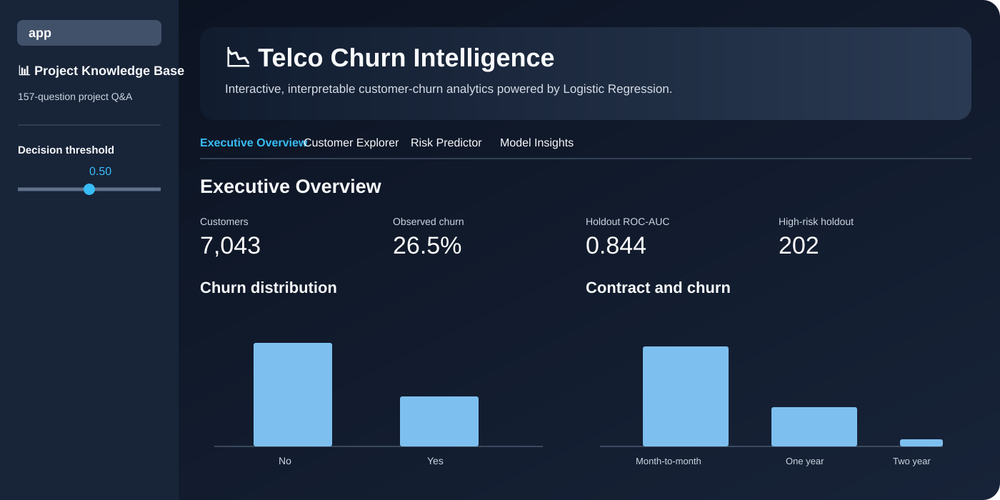

# 📉 Telco Churn Intelligence

### Interpretable Customer Churn Prediction with Logistic Regression

<strong>End-to-end machine learning • Interactive analytics • Explainable risk scoring • Production-style quality controls</strong>

  
  

  
  
  
  
  

---

## 🌐 Explore the live dashboard

### [🚀 Open Telco Churn Intelligence →](https://telco-customer-churn-logistic-regression.streamlit.app/)

**Interactive Streamlit application for exploring churn patterns, scoring customer risk, and interpreting the Logistic Regression model.**

---

## 🖼️ Dashboard Preview

> **Telco Churn Intelligence — Executive Overview**

*Dashboard preview showing executive KPIs, churn distribution, contract-level churn analysis, customer exploration, risk prediction, and model insights.*

---

## ✨ Why this project stands out

This repository is designed as a **complete data-science portfolio project**, not just a model-training notebook.

| Layer | What is included |
|---|---|
| 📊 **Analytics** | Executive KPIs, churn distribution, contract analysis, customer cohorts |
| 🧹 **Data quality** | Type validation, blank handling, duplicate removal, consistency checks |
| 🧠 **Machine learning** | Logistic Regression with regularization and hyperparameter tuning |
| 🔐 **Leakage control** | Preprocessing fitted inside the ML pipeline |
| 📈 **Evaluation** | ROC-AUC, PR-AUC, F1, precision, recall, log loss, Brier score |
| 🎚️ **Decision support** | Interactive classification-threshold analysis |
| 🔎 **Explainability** | Coefficients, odds ratios, probability interpretation |
| 🎯 **Risk segmentation** | Low / Medium / High churn-risk cohorts |
| 🖥️ **Application** | Multi-tab Streamlit analytics workspace |
| 📚 **Knowledge base** | 157 project questions across 18 analytical sections |
| 🧪 **Engineering quality** | Tests, coverage gate, Ruff linting, compilation checks, CI |

---

## 📊 Results at a glance

| Metric | Result |
|:---|---:|
| 👥 Customers | **7,043** |
| 📌 Observed churn | **26.5%** |
| 🔁 5-fold CV ROC-AUC | **0.8477** |
| 🎯 Holdout ROC-AUC | **0.8439** |
| 📈 Holdout PR-AUC | **0.6462** |
| ⚖️ Holdout F1 @ 0.50 | **0.5800** |

> These results correspond to the supplied dataset and the project’s configured preprocessing, split, and tuning workflow.

---

## 🧭 Project workflow

~~~text
Raw CSV
   │
   ▼
Validation & Cleaning
   │
   ▼
Business Feature Engineering
   │
   ▼
Stratified 80/20 Holdout Split
   │
   ▼
Leakage-Safe Preprocessing
   │
   ├── Numeric imputation
   ├── Standard scaling
   └── Categorical imputation + one-hot encoding
   │
   ▼
5-Fold ROC-AUC Cross-Validation
   │
   ▼
Logistic Regression C Tuning
   │
   ▼
Untouched Holdout Evaluation
   │
   ├── ROC-AUC / PR-AUC
   ├── Precision / Recall / F1
   ├── Log Loss / Brier Score
   └── Confusion Matrix
   │
   ▼
Threshold Analysis
   │
   ▼
Coefficient & Odds-Ratio Interpretation
   │
   ▼
Customer Risk Segmentation
   │
   ▼
Interactive Streamlit Decision-Support Dashboard
~~~

---

## 🧠 Business question

> **Which customer characteristics, service patterns, contract structures, and billing behaviors are associated with churn; how accurately can Logistic Regression estimate churn probability; and how can those predictions be translated into interpretable customer-risk segments?**

The project deliberately separates **descriptive associations** from causal claims. Predictive performance does not establish that changing a customer characteristic will cause churn to increase or decrease.

---

## 🖥️ Dashboard experience

### 1. 📌 Executive Overview
- Total customer count
- Observed churn rate
- Holdout ROC-AUC
- High-risk holdout count
- Churn distribution
- Churn rate by contract

### 2. 🔍 Customer Explorer
- Contract
- Internet service
- Payment method
- Observed churn
- Paperless billing
- Senior-citizen status
- Tenure
- Monthly charges
- Total charges

### 3. 🔮 Risk Predictor
- Churn probability
- Risk segment
- Threshold-based classification
- Interpretable prediction context

### 4. 🧬 Model Insights
- Logistic Regression coefficients
- Odds ratios
- Threshold trade-offs
- Confusion matrix
- Risk-segment distribution
- Model evaluation metrics

### 5. 📚 Project Knowledge Base
The Streamlit navigation includes the complete **157-question project Q&A**, organized across **18 analytical sections** covering data, modeling, evaluation, interpretation, limitations, and business impact.

---

## 🧪 Model methodology

The core estimator uses a scikit-learn pipeline so preprocessing and model fitting remain connected and leakage-safe.

### Preprocessing
- Numeric missing-value imputation with the median
- Numeric standardization
- Categorical missing-value imputation
- One-hot encoding with unknown-category handling

### Model
**Logistic Regression** is used because it provides both probability estimates and interpretable coefficients.

Regularization configurations include:
- **L1** regularization
- **L2** regularization
- Tuned C values
- ROC-AUC as the cross-validation selection metric

### Validation
- Stratified **80/20** train-holdout split
- **5-fold** cross-validation on the training set
- Final evaluation on the untouched holdout set

---

## 📁 Repository architecture

~~~text
telco-customer-churn-logistic-regression/
│
├── app.py
├── pages/
│   └── 5_Project_QA.py
│
├── .streamlit/
│   └── config.toml
│
├── assets/
│   └── telco-churn-intelligence-dashboard.svg
│
├── data/
│   ├── README.md
│   └── raw/
│       └── WA_Fn-UseC_-Telco-Customer-Churn.csv
│
├── notebooks/
│   └── telco_customer_churn_logistic_regression.ipynb
│
├── src/
│   ├── __init__.py
│   ├── analysis.py
│   ├── model_service.py
│   └── train_model.py
│
├── tests/
│   ├── test_analysis.py
│   └── test_train_model.py
│
├── docs/
│   ├── PROJECT_QUESTIONS.md
│   └── Telco_Customer_Churn_Project_Questions.docx
│
├── .github/
│   └── workflows/
│       └── ci.yml
│
├── MODEL_CARD.md
├── pyproject.toml
├── requirements.txt
└── README.md
~~~

---

## 🚀 Run locally

### 1. Clone
~~~bash
git clone https://github.com/mightyalok00/telco-customer-churn-logistic-regression.git
cd telco-customer-churn-logistic-regression
~~~

### 2. Create a virtual environment
**Windows:**
~~~powershell
python -m venv .venv
.venv\Scripts\activate
~~~

### 3. Install dependencies
~~~bash
pip install -r requirements.txt
~~~

### 4. Launch the dashboard
~~~bash
streamlit run app.py
~~~

### 5. Run the test suite
~~~bash
pytest -q
~~~

### 6. Run coverage
~~~bash
pytest --cov=src --cov-report=term-missing
~~~

### 7. Run linting
~~~bash
ruff check .
~~~

### 8. Train the standalone model
~~~bash
python src/train_model.py
~~~

---

## ☁️ Deployment

The project is deployed on **Streamlit Community Cloud**.

### Live application

**https://telco-customer-churn-logistic-regression.streamlit.app/**

The application uses the repository dataset and the shared model-service layer for the dashboard and Project Q&A experience.

---

## 🧰 Tech stack

| Category | Technologies |
|---|---|
| Language | Python |
| Data | Pandas, NumPy |
| Machine Learning | Scikit-learn |
| Visualization | Plotly |
| Application | Streamlit |
| Testing | Pytest, Pytest-Cov |
| Code Quality | Ruff |
| CI/CD | GitHub Actions |
| Model persistence | Joblib |

---

## ✅ Engineering & quality controls

GitHub Actions validates the project with:

1. **Ruff linting**
2. **Pytest**
3. **85% minimum coverage gate**
4. **Python compilation checks**
5. **Streamlit application/page compilation checks**

The latest verified project baseline reached **15 passing tests and 97.44% source coverage**.

---

## ⚠️ Responsible use

This dashboard is intended for **educational, analytical, and portfolio demonstration**.

A churn probability should not be treated as a definitive statement about an individual customer. A production retention system would require additional validation, monitoring, fairness review, business-cost analysis, calibration checks, and governance.

---

## 📦 Dataset

The repository contains:

`data/raw/WA_Fn-UseC_-Telco-Customer-Churn.csv`

The dataset contains **7,043 rows and 21 columns**, with `Churn` as the binary target.

> Verify the original dataset’s licensing and source terms before independently redistributing the raw dataset.

---

## 👤 Author

### **Alok Agarwal**

**Data Science • Python • SQL • Machine Learning • Analytics**

[GitHub](https://github.com/mightyalok00) • [Live Dashboard](https://telco-customer-churn-logistic-regression.streamlit.app/)

---

### ⭐ If this project helps you, consider starring the repository.

**Built with Python, scikit-learn & Streamlit.**

